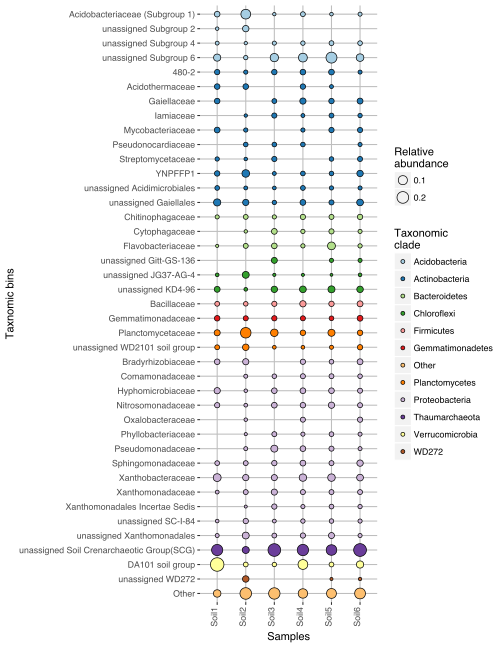

# OTU-table-to-bubble-plot

This R script computes a bubble plots from an [OTU/ASV table](input_files/otu_table.txt) and from a
corresponding [annotation file](input_files/taxonomic_annotation.txt).

Both input files should be tab-separated and contain as first column the 
OTU identifiers. Of course those should be the same between the two
files. Their first line should either contain the sample names (for the
OTU table), or the taxonomic level of annotations.

#### 1. Import variables

Here are the main variables to set up to use this script.

    # Load the environment
    library("reshape2")
    library("stringr")
    library("ggplot2")

    # Path to input files
    otu_tab_file <- "input_files/otu_table.txt"
    tax_file <- "input_files/taxonomic_annotation.txt"

    # List of all replicates, ordered. The names should match the ones in the OTU table.
    replicates_list <- c("S2.1", "S2.2", "S2.3",
                     "S2.4", "S2.5", "S2.6",
                     "S2.7", "S2.8", "S2.9",
                     "S2.10", "S2.11", "S2.12",
                     "S2.13", "S2.14", "S2.15",
                     "S2.16", "S2.17", "S2.18")

    # List of the corresponding replicates groups to which the individual replicates belong to.
    # The order should match the one of 'replicates_list'.
    # If some samples were not replicated, simply re-copy here the 'replicates_list' just above.
    # The order of this list determines the sample order in the bubble plot.
    replicates_groups <- c("Soil1", "Soil1", "Soil1",
                           "Soil2", "Soil2", "Soil2",
                           "Soil3", "Soil3", "Soil3",
                           "Soil4", "Soil4", "Soil4",
                           "Soil5", "Soil5", "Soil5",
                           "Soil6", "Soil6", "Soil6")

    # Do these two list have the same length?
    length(replicates_list) == length(replicates_groups) 

    ## [1] TRUE

    # Taxonomic level that will be aggregated and displaeyed in the bubble plot.
    # It should match a taxonomic level from the taxonomic annotation file.
    # If you want to display OTUs/ASVs, simply write 'OTU'.
    tax_aggr <- "family"

    # Number of taxonomic bins to be displayed in the bubble plot.
    tax_number <- 40

    # Taxonomic level that will be used for colouring bubbles (i.e. categorical variable)
    # It should match a taxonomic level from the taxonomic annotation file
    # (and it should be a higher taxonomic level that the one from 'tax_aggr').
    tax_col <- "phylum"

    # Filename for saving the bubble plot (svg or pdf)
    file_name <- "bubble_plot.svg"

    # Dimension (in inch) of this file (first number is the width, the second number is the height)
    plot_dim <- c(6,6)

#### 2. Import files

    otu_tab <- read.table(otu_tab_file, header = TRUE, comment.char = "", sep = "\t")
    names(otu_tab)[1] <- "OTU"
    otu_tab[1:5,1:5]

    ##    OTU       S2.10      S2.11      S2.12       S2.13
    ## 1 OTU1 0.110178524 0.01222786 0.22880469 0.178220724
    ## 2 OTU2 0.017186251 0.26662690 0.02470170 0.000000000
    ## 3 OTU3 0.004263256 0.00000000 0.02909776 0.015535688
    ## 4 OTU4 0.013855582 0.02296451 0.02784174 0.017441008
    ## 5 OTU5 0.002131628 0.06949001 0.01800293 0.004836582

    tax_tab <- read.table(tax_file, header = TRUE, comment.char = "", sep = "\t", fill = TRUE)
    names(tax_tab)[1] <- "OTU"
    tax_tab[1:5,1:4]

    ##    OTU  kingdom          phylum                          class
    ## 1 OTU1  Archaea  Thaumarchaeota Soil Crenarchaeotic Group(SCG)
    ## 2 OTU2 Bacteria Verrucomicrobia                 Spartobacteria
    ## 3 OTU3  Archaea  Thaumarchaeota Soil Crenarchaeotic Group(SCG)
    ## 4 OTU4 Bacteria  Proteobacteria            Alphaproteobacteria
    ## 5 OTU5  Archaea  Thaumarchaeota Soil Crenarchaeotic Group(SCG)

#### 3. Parse the taxonomic file

This code removes useless annotations from the taxonomic table, such as
'uncultured bacteria', or 'unkwown family', and fills the blanks by
copying the previous taxonomic levels (while adding an 'unassigned'
mention).

    # Delete all cells containing 'uncultured' or 'unkown'
    for (col in 2:ncol(tax_tab)) {
        for (row in 1:nrow(tax_tab)) {
            if (grepl("uncultured",tax_tab[row,col],ignore.case = TRUE)) {
                tax_tab[row,col] <- ""
            }
            if (grepl("unknown",tax_tab[row,col],ignore.case = TRUE)) {
                tax_tab[row,col] <- ""
            }
        }
    }

    # Replace empty cells by 'NA'
    tax_tab2 <- as.data.frame(apply(tax_tab, 2, function(x) gsub("^$|^ $", NA, x)))

    # Remove columns containing only 'NA'
    col_to_remove <- c()

    for (col in 2:ncol(tax_tab2)) {
        x <- sum(is.na(tax_tab2[,col]))/nrow(tax_tab2)
        if (x == 1) {
            col_to_remove <- c(col_to_remove, col)
        }
    }

    if (length(col_to_remove) > 0) {
        tax_tab3 <- tax_tab2[,-col_to_remove]
    } else {
        tax_tab3 <- tax_tab2
    }

    # Set taxonomic annotations as character variables

    for (col in 2:ncol(tax_tab3)) {
        tax_tab3[,col] <- as.character(tax_tab3[,col])
    }

    # Fill all NAs

    for (col in 1:ncol(tax_tab3)) {
        for (row in 1:nrow(tax_tab3)) {
            if (is.na(tax_tab3[row,col])) {
                if (!grepl("OTU", tax_tab3[row,col-1]) & !grepl("unassigned", tax_tab3[row,col-1])) {
                    tax_tab3[row,col] <- paste0("unassigned ", tax_tab3[row,col-1])
                } else {
                    tax_tab3[row,col] <- tax_tab3[row,col-1]
                }
            }
        }
    }

#### 4. Compute the relative abundance of OTUs for each sample

You can run this command even if your OTU table already contains
relative abundances instead of reads counts. It won't hurt.

    otu_counts <- colSums(otu_tab[,-1])
    otu_tab2 <- otu_tab
    otu_tab2[,-1] <- sweep(otu_tab[,-1], 2, otu_counts, `/`)
    otu_tab2[is.na(otu_tab2)] <- 0

    # Check that the sum of relative abundances for each sample is 1.
    colSums(otu_tab2[,-1])

    ## S2.10 S2.11 S2.12 S2.13 S2.14 S2.15 S2.16 S2.17 S2.18  S2.1  S2.2  S2.3 
    ##     1     1     1     1     1     1     1     1     1     1     1     1 
    ##  S2.4  S2.5  S2.6  S2.7  S2.8  S2.9 S1.1b  S1.1 S1.2b  S1.2 S1.3b  S1.3 
    ##     1     1     1     1     1     1     1     1     1     1     1     1 
    ## S1.4b  S1.4 
    ##     1     1

#### 5. Merge the OTU and taxonomic tables together

    m <- merge(otu_tab2, tax_tab3)

    # Has the merged table the expected dimension?
    dim(m)

    ## [1] 3715   34

#### 6. Aggregate the table to taxonomic level defined in the variable 'tax\_aggr'

    # First, we should save in a column the taxonomic information needed for computing the bubble plot

    taxonomy <- c()
    for (row in 1:nrow(m)) {
        taxonomy <- c(taxonomy, paste0(m[row,names(m)==tax_col], ";", m[row,names(m)==tax_aggr]))
    }

    # Subset from the merged table the selected samples only
    m2 <- m[,names(m) %in% replicates_list]

    # Aggregate 'm2' based on the selected taxonomic level
    m3 <- aggregate(m2, by=list(taxonomy), FUN=sum)

    dim(m3)

    ## [1] 330  19

    m3[1:5,1:4]

    ##                                        Group.1      S2.10      S2.11 S2.12
    ## 1                         Acidobacteria;ABS-19 0.00000000 0.00000000     0
    ## 2 Acidobacteria;Acidobacteriaceae (Subgroup 1) 0.01212363 0.01968387     0
    ## 3                         Acidobacteria;DS-100 0.00000000 0.00000000     0
    ## 4                         Acidobacteria;Nov.24 0.00000000 0.00000000     0
    ## 5                        Acidobacteria;PAUC26f 0.00000000 0.00000000     0

#### 7. Sort the table by decreasing size of taxonomic groups

Here we only keep the 'x' top taxonomic groups, as defined in the
`tax_number` variable. All the others taxonomic groups will be pooled
together in a new bin labelled 'Other'.

    # Sort the taxonomic table

    if (tax_number > nrow(m3)) {
            tax_number <- nrow(m3)
        }
        
    m3$average <- rowMeans(m3[,-1])
    m3.sorted <- m3[order(-m3$average),]

    # Aggregate the smaller taxonomic bins together
    m3.sorted$selection <- rep("discarded", nrow(m3.sorted))
    m3.sorted$selection[1:tax_number] <- "retained"
    m3.sorted$Group.1[m3.sorted$selection == "discarded"] <- "Other;Other"
    m3.sorted$average <- NULL
    m3.sorted$selection <- NULL
    m4 <- aggregate(m3.sorted[,-1], by=list(taxonomy=m3.sorted$Group.1), FUN=sum)

    # What is the relative abundances of the taxonomic bins that were pooled together in the 'Other' bin?
    m4[m4$taxonomy == "Other;Other", -1]

    ##        S2.10     S2.11      S2.12     S2.13     S2.14     S2.15     S2.16
    ## 23 0.1881162 0.0480167 0.09462005 0.1176902 0.1330054 0.1217922 0.1371706
    ##        S2.17     S2.18       S2.1       S2.2       S2.3      S2.4
    ## 23 0.1397341 0.2054837 0.04790419 0.07034463 0.04697761 0.2375701
    ##         S2.5      S2.6      S2.7     S2.8      S2.9
    ## 23 0.1740081 0.1765232 0.1460825 0.265434 0.1512048

    mean(as.numeric(m4[m4$taxonomy == "Other;Other", -1]))

    ## [1] 0.1389821

    # If you find these numbers too big, you can simply increase the value of the 'tax_number' variable,
    # Or alternatively choose a higher taxonomic level to display

#### 8. Transpose 'm4'

It's needed to 'melt' it later.

    n <- m4$taxonomy
    m4.t <- as.data.frame(t(m4[,-1]))
    colnames(m4.t) <- n
    m4.t$sample <- rownames(m4.t)
    rownames(m4.t) <- NULL

#### 9. Calculate the mean and the standard deviation for each sample

    m4.t$replicate <- rep(NA, nrow(m4.t))
    for (line in 1:(nrow(m4.t))){
        m4.t$replicate[line] <- replicates_groups[m4.t$sample[line] == replicates_list]
    }

    # Compute the mean
    m4.t.mean <- aggregate(m4.t[,1:(ncol(m4.t)-2)],
                                  by = list(m4.t$replicate),
                                  FUN = "mean")
    names(m4.t.mean)[1] <- "sample"

    dim(m4.t.mean)                              

    ## [1]  6 42

    # Compute the standard deviation                             
    m4.t.sd <- aggregate(m4.t[,1:(ncol(m4.t)-2)],
                                  by = list(m4.t$replicate),
                                  FUN = "sd")
    names(m4.t.sd)[1] <- "sample"
                                  
    dim(m4.t.sd)                              

    ## [1]  6 42

#### 10. Melt and merge the two dataframes

    # Melt the dataframes
    molten.mean <- melt(m4.t.mean, id.vars = "sample")
    molten.mean$id <- paste0(molten.mean$sample, "-", molten.mean$variable)

    molten.sd <- melt(m4.t.sd, id.vars = "sample")
    molten.sd$id <- paste0(molten.sd$sample, "-", molten.sd$variable)

    # Merge the dataframes
    molten <- merge(molten.mean, molten.sd, by.x = "id", by.y = "id")

#### 11. Final rearragement of the dataframe

Few last things before we can plot the data!

    molten$id <- NULL
    molten$sample.y <- NULL
    molten$variable.y <- NULL
    names(molten) <- c("sample", "taxonomy", "mean", "sd")

    molten$tax_col <- str_split_fixed(molten$taxonomy, ";", 2)[,1]
    molten$tax_bin <- str_split_fixed(molten$taxonomy, ";", 2)[,2]

    # Reorder the taxonomic annotation for the plot
    molten <- molten[order(molten$tax_col),]
    tax_levels <- as.character(molten$tax_bin[!duplicated(molten$tax_bin)])
    tax_levels <- tax_levels[tax_levels != "Other"]
    tax_levels <- c(tax_levels, "Other")
    molten$tax_bin <- factor(molten$tax_bin, levels = rev(tax_levels))
    molten$tax_bin <- factor(molten$tax_bin)

    # Remove null values
    molten2 <- molten[molten$mean > 0,]

#### 12. Compute the bubble plot (finally!)

-   If you want to display the standard deviation on the plot, you can
    simply remove the first hash (\#) symbol in the script below. It
    will display the standard deviation as a red bubble behind each
    bubble.
-   You can choose between different palettes from 'ColorBrewer2', as
    shown here: 
-   It could be that ther are not enough colours in this different sets
    to cover all the categories to display. In this case, some of them
    will appear transparent in the plot. To fix this, you can
    alternatively:
    -   select a higher taxonomic level to display with the `tax_col`
        variable, or
    -   use `scale_fill_discrete()` instead of `scale_fill_brewer()`,
    -   create your own color palette using `scale_fill_manual()`. See
        <https://www.nceas.ucsb.edu/~frazier/RSpatialGuides/colorPaletteCheatsheet.pdf>
        for more information about colours in R.

<!-- -->

    bubble_plot <- ggplot(molten2,aes(sample,tax_bin)) +
        #geom_point(aes(size=mean+sd), shape=16, color = "red") + 
        geom_point(aes(size=mean, fill=molten2$tax_col),shape=21,color="black") +
        theme(panel.grid.major=element_line(linetype=1,color="grey"),
              axis.text.x=element_text(angle=90,hjust=1,vjust=0),
              panel.background = element_blank()) +
        ylab("Taxnomic bins") +
        xlab("Samples") +
        scale_fill_brewer(palette="Paired", name="Taxonomic\nclade") +
        #scale_fill_discrete(name="Taxonomic\nclade") +
        #scale_fill_manual(values= c("maroon2", "pink", "#000000"), name="Taxonomic\nclade") +
        scale_size(name = "Relative\nabundance")

    bubble_plot

#### 13. Exporting the plot

This code exports the bubble plot as svg file that can be later modified
using Inkscape (free and open source; <https://inkscape.org/>) or Adobe
Illustrator. Alternatively, the plot can be saved as pdf using the
`pdf()` function instead of `svg()`.

    svg(file_name, width = plot_dim[1], height = plot_dim[2])
    bubble_plot
    dev.off()

